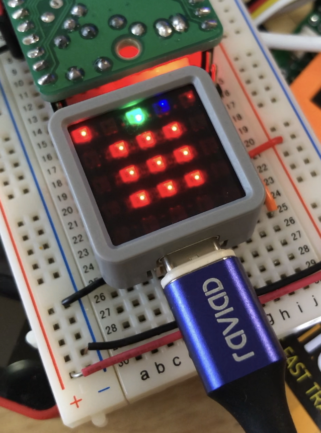
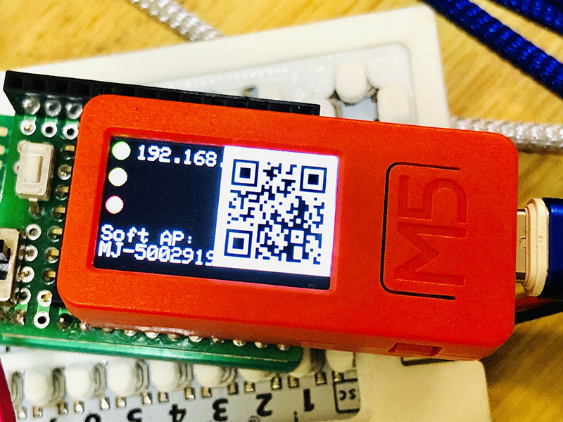

# MicJack (マイク・ジャック) 

CC BY Michio Ono (Micono Utilities) 

**MicJack** は、IchigoJamとつないで、インターネットにつなげて使えるMixJuice互換のESP-WROOM-02（以降、ESP8266）用のプログラムです。また最新バージョンでは、ESP-WROOM-32（以降、ESP32）にも対応しました。ESP8266を搭載したモジュールの他、ESP32を搭載したM5Stackなどに入れて使うことができます。またMicJackは、トイドローンのTelloの操作を行うためのコマンドにも対応しています。

[イチゴジャムシピさんのサイトでMicJackに関しての紹介して頂いております。](https://15jamrecipe.jimdofree.com/mixjuice/micjack/)

#### MicJackの特徴
- MixJuice v1.3 とほぼ互換の機能
- 簡単なWebサーバー機能
- Web画面経由での仮想キーボード
- Kidspod; に対応したコマンド
- Kidspod; にIchigonQuestのプログラムの受送信
- Tello 操作コマンド
- ESP32系にも対応：ESP32系モジュール版、M5Stack版、M5StickC版、M5Atom版 
- ESP32系でIchigoJamのLED信号の入力に対応
- M5Stack / M5StickC / M5Atom で、CardKBユニットやFACESを使った文字入力
- SPIFFSやSDにIchigoJamのプログラムを保存できます

**(ESP32系の説明は同梱のManual.pdfの「ESP32版の簡単な説明」に簡単に書いてあります)**

    **M5Atom** 
 **M5StickC**  **M5StickC plus** 
 
**文字の入力は、スマホのバーチャルキーボードや, [M5StackのCardKB](https://www.switch-science.com/catalog/5689/),または [M5CardKB for MJ](https://github.com/micutil/M5CardKB_for_MJ)で入力することもできます** 
 

#### [TELLOについて]
200g以下の軽量トーイドローンの [**TELLO (RYYZE社)** ](https://www.ryzerobotics.com/jp/tello) を操作コマンドに対応しています。また、IchigoJamでTELLO / TELLO EDUをコントロールできるようにした [FruitPonch (フルーツポンチ)](https://na-s.jp/FruitPunch/) の省略操作コマンドにも似せてあります。以下のようなIchigoJamを利用してTelloを操作しているページがありますので参考にして下さい。

- [TELLO EDU x IchigoJam - プログラミングでeスポーツ大会＠鯖江](https://fukuno.jig.jp/2471)
- [ How to fly a drone with programming by IchigoJam! / IchigoDakeでドローン “Tello” をプログラミングする方法！]()
- [ IchigoJam + Tello フライト マニュアル (IchigoJam BASIC編)](https://na-s.jp/FruitPunch/docs/manual_1.1.0_ja.html)

**[更新内容]**

v1.3.0b1 (2020/8/2) 

- (新規) SPIFFSやSDにIchigoJamのプログラムを読み書きできるようになった。
- (新規) M5StickC Plusに対応。
- (修正) M5Stack, M5StickCの表示の不具合を修正。

v1.2.3b4 (2020/7/3) 

- (修正) キーボード入力モードの不具合を修正。

v1.2.3b3 (2020/6/29) 

- (修正) キーボード信号モードでもUARTモードのままになっていた不具合を修正。
- (変更) キーボード信号モードでキーボード初期化されてない場合はUARTで送信するようにした。
- (修正) M5Stack, M5StickC, M5Atomで、CardKBが使えない不具合を修正。
- (修正) M5Atomでキーボード信号モードで入力できない不具合を修正

v1.2.3b2 (2020/6/14) 

- (新規) M5Atomに対応
- (更新) ps2devライブラリ更新に伴う更新。
- (修正) MJ GETRTC (日時を取得)を修正。
- (変更) MJ PSUB # コマンドを再度対応に変更。
- (ほか) IJUtilitiesがESP32系のインストールに対応。

v1.2.2b2 (2020/5/4 ESP32系のみの更新) 

- (新規) ESP32系につながっているIchigoJamのファームの更新に対応 
- (修正) USBシリアルから入出力の不具合を修正。
- (改変) MJ PSUB # コマンドを未対応に変更。

v1.2.2b1 (2020/5/4 ESP32系のみの更新) 

- (新規) LEDの状況を受けるポートを設定(M5StickCでは内蔵LEDに連動) 
- (新規) MJ PSUB # コマンド追加
- (改変) USBシリアルから入出力できるようにした。
- (改変) M5StickCでGROVEポートでキーボード入力対応した。

v1.2.1b1 (2020/4/29)

- (新規) MJ SETRTC (M5StickCのみ：RTCの時間を設定）、MJ GETRTC (日時を取得）コマンドを追加
- (新規) M5Stack / M5StickC版で、CardKBユニットまたはFACESによる文字入力に対応
- (修正) UDPのSoftAP接続に関しての不具合を修正した

v1.2.0b1 (2020/4/19)

- (新規) ESP32系（ESP-WROOM-32モジュール、M5Stack, M5StickC）版を作成
- (修正) 起動時の自動接続の不具合を修正

v1.1.0b2 (2020/3/22)

- (新規) Telloドローンのコントロールに対応しました(現行でEdu未対応)。
- (新規) 8個のアクセス先を登録できるようにしました。
- (変更)UDPの仕様をMixJuiceに合わせて少し変更しました。
- (変更)アクセスポイントSSID名をMixJuiceに合わせてMicJackからMJ-XXXXXXXXXXXX に 変更しました (XX.. には MixJuice の Mac アドレスが入ります)。

v1.0.1b2 (2018/10/10)
 
- (新規) MJ GETSLASTの不具合修正

v1.0.1b1 (2018/10/8)

- (新規) MJ IJKBD追加:IchigoJamでキーボードモードを使う場合
- (新規) MJ GETSHOME追加:GETHOMEのGETS対応版
- (新規) MJ GETSLAST追加:GETLASTのGETS対応版

## バイナリーのインストール

### IJUtilitiesを使う場合

1. IJUtilitiesを[ダウンロード](http://ijutilities.micutil.com)し、解凍する。
2. IJUtilitiesの中のfirmwaresフォルダの中に、MicJackに同梱のfirmwaresフォルダの中のMicJackフォルダをコピーします（たぶん既に入っているMicJackフォルダはバージョンが古い為、置き換えます）。
3. IJUtilitiesを起動し、「オプション」メニューの「ESP Tool」を選ぶ。
4. インストール先のPortや適切なSpeedを選ぶ
5. Prisetでインストールするファームを選ぶ
6. 「スタート」ボタンを押すとインストールが始まります。

インストールには、パソコンとESP8266モジュール, ESP32モジュール, M5Stack, M5StickCなどとを適切に接続しておく必要があります。ジャンパーワイヤーなどで繋がなくては行けない場合は、Manualフォルダの中のManual.pdfを参考にしてください。

## 接続に関して

**ESP8266系モジュール**

|GPIO |機能・接続|
|----------------|-------|
| G12 | 接続状態（緑LED） |
| G4 | POST（黄LED） |
| G5 | GET（赤LED） |
| G13 | CLK: KBD1に接続 (#1) |
| G16 | DATA: KBD2に接続 (#1) |
| G1 | TX |
| G3 | RX |

**ESP32系モジュール**

|GPIO |機能・接続|
|----------------|-------|
| G12 | 接続状態（緑LED） |
| G4 | POST（黄LED） |
| G5 | GET（赤LED） |
| G17 | TX2: IchigoJamのRXと接続 |
| G16 | RX2: IchigoJamのTXと接続 |
| G21 | CLK: KBD1に接続 (#1) |
| G22 | DATA: KBD2に接続 (#1)） |
| G15 | IchigoJam LED信号の入力 |
| G2 | G15の信号の出力（内蔵LED） |
| G1 | TX:コンピュータと接続 |
| G3 | RX:コンピュータと接続 |

**ESP32系モジュール (SDカード版)**

|GPIO |機能・接続| ILI9341 |
|----------------|-------|---|
| G12 | 接続状態（緑LED） | |
| G4 | POST or GET |
| G17 | TX2: IchigoJamのRXと接続 | |
| G16 | RX2: IchigoJamのTXと接続 | |
| G21 | CLK: KBD1に接続 (#1) | |
| G22 | DATA: KBD2に接続 (#1)） | |
| G15 | IchigoJam LED信号の入力 | |
| G2 | G15の信号の出力（内蔵LED） | |
| G1 | TX:コンピュータと接続 | |
| G3 | RX:コンピュータと接続 | |
| G5 | SS | SD_CS |
| G23 | MOSI | SD_MOSI |
| G19 | MISO | SD_MISO |
| G18 | SCK | SD_SCK |

**M5Stack**

|GPIO |機能・接続|
|----------------|-------|
| G17 | TX2: IchigoJamのRXと接続 |
| G16 | RX2: IchigoJamのTXと接続 |
| G21 | CLK: KBD1に接続 (#1) |
| G22 | DATA: KBD2に接続 (#1) |
| G35 | IchigoJam LED信号の入力 |
| G2 | G35の信号の出力 |

- USB-C: TX/RX (G1/G3)
- GROVE: SCL/SDA (G32/G33)

**M5StickC / M5StickC plus**

|GPIO |機能・接続|
|----------------|-------|
| G26 | TX2: IchigoJamのRXと接続 |
| G0 | RX2: IchigoJamのTXと接続 |
| G33 | CLK: KBD1に接続 (#1) |
| G32 | DATA: KBD2に接続 (#1) |
| G36 | IchigoJam LED信号の入力 |
| G10 | G36の信号の出力（内蔵LED） |

- USB-C: TX/RX (G1/G3)
- GROVE: SCL/SDA (G32/G33)

**M5Atom Lite / Matrix / Echo**

|GPIO |機能・接続|
|----------------|-------|
| G22 | TX2: IchigoJamのRXと接続 |
| G19 | RX2: IchigoJamのTXと接続 |
| G21 | CLK: KBD1に接続 (#1) |
| G25 | DATA: KBD2に接続 (#1) |
| G23 | BTN: IchigoJamのBTNと接続 |
| G33 | LED: IchigoJamのLEDに接続 |

- USB-C: TX/RX (G1/G3)
- GROVE: SCL/SDA (G26/G32)

(#1) キーボードモードによる入力を行う場合は接続してください。
 
 
## コマンド一覧

|コマンド名 |機能|
|----------------|-------|
| MJ APC / TJ APC / FP APC | WiFiアクセスポイントに接続 |
| MJ APD / TJ APD / FP APD | Wi-Fi接続を切断 | 
| MJ APL / TJ APL / FP APL | WiFiアクセスポイントの一覧を表示 |
| MJ APS / TJ APS / FP APS | WiFiアクセスポイントへの接続を確認 |
| MJ SSID | WiFiアクセスポイントのSSIDの表示、デフォルトのSSIDを設定 |
| MJ SOFTAP | SoftAPのSSID名とIPを表示、SSIDとパスワードを設定
| MJ PWD | デフォルトのSSIDのパスワードを設定
| MJ RGA / TJ RGA | WiFiアクセスポイントのSSIDとパスワードを登録
| MJ RGC / TJ RGC | RGAで登録したWiFiアクセスポイントに登録番号で接続
| MJ RGL / TJ RGL | REGAPで登録したWiFiアクセスポイントの一覧を表示
| MJ RGD / TJ RGD | RGAで登録したWiFiアクセスポイントを消去
| MJ LIP | ローカルIPを表示
| MJ GET | HTTPでGET通信
| MJ GETS | HTTPSでGET通信
| MJ GETHOME | 設定したデフォルトページをGET通信
| MJ GETSHOME | 設定したデフォルトページをGETS通信
| MJ GETLAST | 最後に通信したページをGET通信
| MJ GETSLAST | 最後に通信したページをGETS通信
| MJ PROXY | Proxyの設定および表示
| MJ PORT | ポート番号の設定および表示
| MJ POST ... | HTTPでPOST送信
| MJ POSTS ... | HTTPSでPOST送信
| MJ PCT | HTTPSでPOST送信でのコンテントタイプを指定
| MJ GKP | Kidspod.clubからHTTPでGET通信
| MJ PKP | Kidspod.clubにHTTPでPOST送信
| MJ QGKP | kidspod.clubからIchigonQuestのプログラムをHTTPでGET通信
| MJ QPKP | Kidspod.clubにIchigonQuestのプログラムをHTTPでPOST送信
| MJ QSEND | chigonQuestのHEXプログラムを送信します。
| MJ UART | HTTPでの入力操作でUARTで送信
| MJ KBD | HTTPでの入力操作でキーボード信号として送信
| MJ IJKBD | IchigoJamでHTTPでの入力操作でキーボード信号として送信する場合
| MJ SPW | HTTPでGET通信において、文字送信遅延の設定
| MJ MACADDR | MACアドレスを表示
| MJ MAC | MACアドレスを表示(MixJuiceと同じ表示形式)
| MJ SLEEP | スリープ(節電モード)|
| MJ PMODE | ESP-WROOM-02のピンモード設定
| MJ DWRT| ESP-WROOM-02でdigitalWriteを実行
| MJ DREAD | ESP-WROOM-02でdigitalReadを実行
| MJ AWRT | ESP-WROOM-02でanalogWriteを実行
| MJ AREAD | ESP-WROOM-02でanalogReadを実行
| MJ MJVER | MicJackのバージョン番号を表示
| MJ SVR | サーバーを起動
| MJ UDP START | UDPを起動
| MJ UDP STOP | UDPを停止
| MJ UDP MSG | 最後に使ったリモートIP/PortにデータをUDPで送信
| MJ UDP | 指定したリモートIP/PortにデータをUDPで送信
| MJ SETRTC | RTCの時間を合わせます（M5StickCのみ）
| MJ GETRTC | 日時時間を取得 引数=なし or 1〜9
| MJ PSUB | ESP32系でUSBシリアルの入出力 引数 0 or 1
| MJ LOAD 数 | IchigoJamのプログラムを読込ます
| MJ SAVE 数 | IchigoJamのプログラムを保存します
| MJ FILES | 保存されているプログラムをリスト表示します
| MJ DIR | IchigoJamのプログラムを読込ます。/がroot, /filesに保存されてます
| MJ DELETE 数 | 保存されているプログラムを消去します
| TJ INIT / FP INIT | Tello操作を開始
| TJ START / FP START | Tello操作を開始
| TJ CLOSE | Tello操作を終了
| TJ STATE | Telloの情報を取得
| TJ RESON | Telloのコマンド実行後の結果を表示
| TJ RESOFF | Telloのコマンド実行後の結果を非表示
| TJ Qxxx | FPに準じたTelloのQueueコマンドを送信
| TJ xxxx / TJ S xxxx | Telloのコマンドを送信

## 注意・免責 

- SPIFFSを使用しています。SPIFFSにデーターを転送するためのセットアップを行う必要が あります。以下のURLの「[Arduino IDE に ESP8266 SPIFFS ファイルシステムアップローダー をインストールする方法](https://www.mgo-tec.com/spiffs-filesystem-uploader01-html)」などを参考にしてください。
- ドローンのコントロールは、ぶつけたことによる、ドローンの破損、その他の破損、怪我などに十分気をつけて行って下さい。
- なお、MicJack関連を利用したことによるいかなるトラブルに関して、私は一切の責任を負いません。十分に注意して行ってください。

## ライセンス

CC BY IchigoJam http://ichigoJam.net
CC BY IchigoJam-for-Display-1.2 font http://ijutilities.micutil.com
CC BY IchigoLatte-for-Display font http://il.micutil.com
