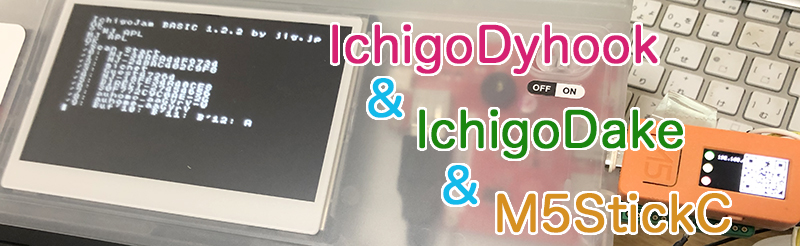
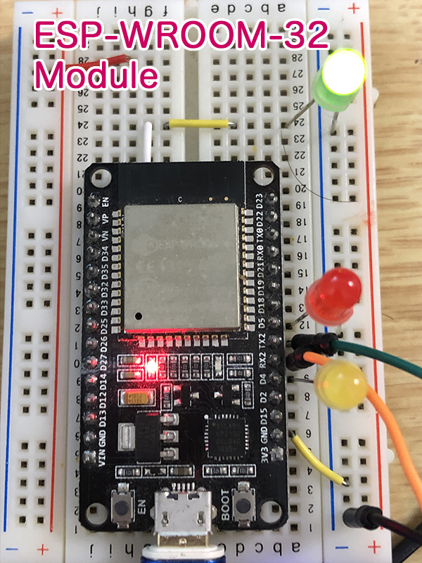
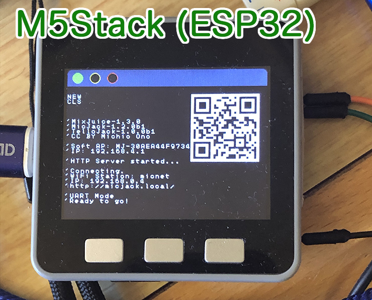
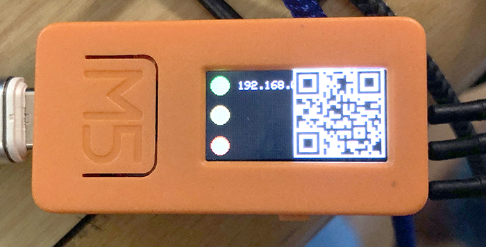
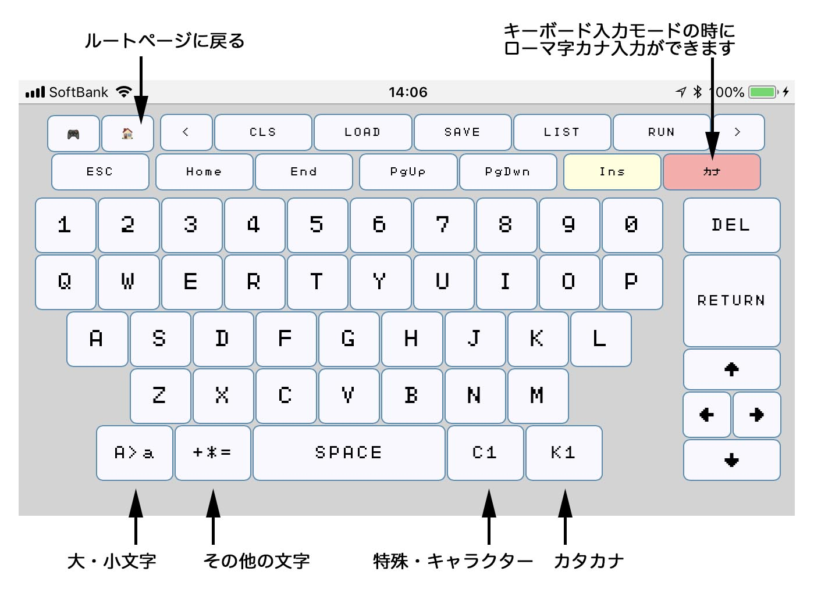

# MicJack (マイク・ジャック) 

CC BY Michio Ono (Micono Utilities) 

**MicJack** は、IchigoJamとつないで、インターネットにつなげて使えるMixJuice互換のESP-WROOM-02（以降、ESP8266）用のプログラムです。また最新バージョンでは、ESP-WROOM-32（以降、ESP32）にも対応しました。ESP8266を搭載したモジュールの他、ESP32を搭載したM5Stackなどに入れて使うことができます。またMicJackは、トイドローンのTelloの操作を行うためのコマンドにも対応しています。

[イチゴジャムシピさんのサイトでMicJackに関しての紹介して頂いております。](https://15jamrecipe.jimdo.com/mixjuice/micjack/)

#### MicJackの特徴
- MixJuice v1.3 とほぼ互換の機能
- 簡単なWebサーバー機能
- Web画面経由での仮想キーボード
- Kidspod; に対応したコマンド
- Kidspod; にIchigonQuestのプログラムの受送信
- Tello 操作コマンド
- ESP32系にも対応：ESP32系モジュール版、M5Stack版、M5StickC版 
- M5Stack / M5StickC で、CardKBユニットやFACESを使った文字入力

**(ESP32系の説明は同梱のManual.pdfの「ESP32版の簡単な説明」に簡単に書いてあります)**

   
 **M5StickC** 
 **スマホのバーチャルキーボードで入力** 
 

#### [TELLOについて]
200g以下の軽量トーイドローンの [**TELLO (RYYZE社)** ](https://www.ryzerobotics.com/jp/tello) を操作コマンドに対応しています。また、IchigoJamでTELLO / TELLO EDUをコントロールできるようにした [FruitPonch (フルーツポンチ)](https://na-s.jp/FruitPunch/) の省略操作コマンドにも似せてあります。以下のようなIchigoJamを利用してTelloを操作しているページがありますので参考にして下さい。

- [TELLO EDU x IchigoJam - プログラミングでeスポーツ大会＠鯖江](https://fukuno.jig.jp/2471)
- [ How to fly a drone with programming by IchigoJam! / IchigoDakeでドローン “Tello” をプログラミングする方法！]()
- [ IchigoJam + Tello フライト マニュアル (IchigoJam BASIC編)](https://na-s.jp/FruitPunch/docs/manual_1.1.0_ja.html)

**[更新内容]**
 
v1.2.1b1 (2020/4/29)

- (新規) MJ SETRTC (M5StickCのみ：RTCの時間を設定）、MJ GETRTC (日時を取得）コマンドを追加
- (新規) M5Stack / M5StickC版で、CardKBユニットまたはFACESによる文字入力に対応
- (修正) UDPのSoftAP接続に関しての不具合を修正した

v1.2.0b1 (2020/4/19)

- (新規) ESP32系（ESP-WROOM-32モジュール、M5Stack, M5StickC）版を作成
- (修正) 起動時の自動接続の不具合を修正

v1.1.0b2 (2020/3/22)

- (新規) Telloドローンのコントロールに対応しました(現行でEdu未対応)。
- (新規) 8個のアクセス先を登録できるようにしました。
- (変更)UDPの仕様をMixJuiceに合わせて少し変更しました。
- (変更)アクセスポイントSSID名をMixJuiceに合わせてMicJackからMJ-XXXXXXXXXXXX に 変更しました (XX.. には MixJuice の Mac アドレスが入ります)。

v1.0.1b2 (2018/10/10)
 
- (新規) MJ GETSLASTの不具合修正

v1.0.1b1 (2018/10/8)

- (新規) MJ IJKBD追加:IchigoJamでキーボードモードを使う場合
- (新規) MJ GETSHOME追加:GETHOMEのGETS対応版
- (新規) MJ GETSLAST追加:GETLASTのGETS対応版

### コマンド一覧

|コマンド名 |機能|
|----------------|-------|
| MJ APC / TJ APC / FP APC | WiFiアクセスポイントに接続 |
| MJ APD / TJ APD / FP APD | Wi-Fi接続を切断 | 
| MJ APL / TJ APL / FP APL | WiFiアクセスポイントの一覧を表示 |
| MJ APS / TJ APS / FP APS | WiFiアクセスポイントへの接続を確認 |
| MJ SSID | WiFiアクセスポイントのSSIDの表示、デフォルトのSSIDを設定 |
| MJ SOFTAP | SoftAPのSSID名とIPを表示、SSIDとパスワードを設定
| MJ PWD | デフォルトのSSIDのパスワードを設定
| MJ RGA / TJ RGA | WiFiアクセスポイントのSSIDとパスワードを登録
| MJ RGC / TJ RGC | RGAで登録したWiFiアクセスポイントに登録番号で接続
| MJ RGL / TJ RGL | REGAPで登録したWiFiアクセスポイントの一覧を表示
| MJ RGD / TJ RGD | RGAで登録したWiFiアクセスポイントを消去
| MJ LIP | ローカルIPを表示
| MJ GET | HTTPでGET通信
| MJ GETS | HTTPSでGET通信
| MJ GETHOME | 設定したデフォルトページをGET通信
| MJ GETSHOME | 設定したデフォルトページをGETS通信
| MJ GETLAST | 最後に通信したページをGET通信
| MJ GETSLAST | 最後に通信したページをGETS通信
| MJ PROXY | Proxyの設定および表示
| MJ PORT | ポート番号の設定および表示
| MJ POST ... | HTTPでPOST送信
| MJ POSTS ... | HTTPSでPOST送信
| MJ PCT | HTTPSでPOST送信でのコンテントタイプを指定
| MJ GKP | Kidspod.clubからHTTPでGET通信
| MJ PKP | Kidspod.clubにHTTPでPOST送信
| MJ QGKP | kidspod.clubからIchigonQuestのプログラムをHTTPでGET通信
| MJ QPKP | Kidspod.clubにIchigonQuestのプログラムをHTTPでPOST送信
| MJ QSEND | chigonQuestのHEXプログラムを送信します。
| MJ UART | HTTPでの入力操作でUARTで送信
| MJ KBD | HTTPでの入力操作でキーボード信号として送信
| MJ IJKBD | IchigoJamでHTTPでの入力操作でキーボード信号として送信する場合
| MJ SPW | HTTPでGET通信において、文字送信遅延の設定
| MJ MACADDR | MACアドレスを表示
| MJ MAC | MACアドレスを表示(MixJuiceと同じ表示形式)
| MJ SLEEP | スリープ(節電モード)|
| MJ PMODE | ESP-WROOM-02のピンモード設定
| MJ DWRT| ESP-WROOM-02でdigitalWriteを実行
| MJ DREAD | ESP-WROOM-02でdigitalReadを実行
| MJ AWRT | ESP-WROOM-02でanalogWriteを実行
| MJ AREAD | ESP-WROOM-02でanalogReadを実行
| MJ MJVER | MicJackのバージョン番号を表示
| MJ SVR | サーバーを起動
| MJ UDP START | UDPを起動
| MJ UDP STOP | UDPを停止
| MJ UDP MSG | 最後に使ったリモートIP/PortにデータをUDPで送信
| MJ UDP | 指定したリモートIP/PortにデータをUDPで送信
| MJ SETRTC | RTCの時間を合わせます（M5StickCのみ）
| MJ GETRTC | 日時時間を取得 引数=なし or 1〜9
| TJ INIT / FP INIT | Tello操作を開始
| TJ START / FP START | Tello操作を開始
| TJ CLOSE | Tello操作を終了
| TJ STATE | Telloの情報を取得
| TJ RESON | Telloのコマンド実行後の結果を表示
| TJ RESOFF | Telloのコマンド実行後の結果を非表示
| TJ Qxxx | FPに準じたTelloのQueueコマンドを送信
| TJ xxxx / TJ S xxxx | Telloのコマンドを送信

### ピンアサイン

**ESP8266系モジュール**

|GPIO |機能|
|----------------|-------|
| G12 | 接続状態（緑LED） |
| G4 | ポスト（黄LED） |
| G5 | ゲット（赤LED） |
| G1 | TX |
| G3 | RX |
| G13 | CLK: KBD1に接続 |
| G16 | DATA: KBD1に接続 |

**ESP32系モジュール**

|GPIO |機能|
|----------------|-------|
| G12 | 接続状態（緑LED） |
| G4 | ポスト（黄LED） |
| G5 | ゲット（赤LED） |
| G1 | TX:コンピュータと接続 |
| G3 | RX:コンピュータと接続 |
| G17 | TX2: IchigoJamのRXと接続 |
| G16 | RX2: IchigoJamのTXと接続 |
| G21 | CLK: KBD1に接続 |
| G22 | DATA: KBD1に接続 |

**M5Stack**

|GPIO |機能|
|----------------|-------|
| G1 | TX:コンピュータと接続 |
| G3 | RX:コンピュータと接続 |
| G17 | TX2: IchigoJamのRXと接続 |
| G16 | RX2: IchigoJamのTXと接続 |
| G21 | CLK: KBD1に接続 |
| G22 | DATA: KBD1に接続 |

**M5StickC**

|GPIO |機能|
|----------------|-------|
| G1 | TX:コンピュータと接続 |
| G3 | RX:コンピュータと接続 |
| G26 | TX2: IchigoJamのRXと接続 |
| G0 | RX2: IchigoJamのTXと接続 |
| G21 | CLK: KBD1に接続 |
| G22 | DATA: KBD1に接続 |

## 注意・免責 

- SPIFFSを使用しています。SPIFFSにデーターを転送するためのセットアップを行う必要が あります。以下のURLの「[Arduino IDE に ESP8266 SPIFFS ファイルシステムアップローダー をインストールする方法](https://www.mgo-tec.com/spiffs-filesystem-uploader01-html)」などを参考にしてください。
- ドローンのコントロールは、ぶつけたことによる、ドローンの破損、その他の破損、怪我などに十分気をつけて行って下さい。
- なお、MicJack関連を利用したことによるいかなるトラブルに関して、私は一切の責任を負いません。十分に注意して行ってください。

## ライセンス

CC BY IchigoJam http://ichigoJam.net 
CC BY IchigoJam-for-Display-1.2 font http://ijutilities.micutil.com  
CC BY IchigoLatte-for-Display font http://il.micutil.com 